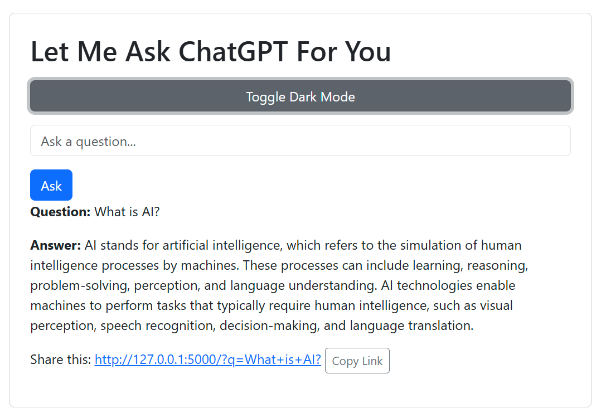

# LMACFY: Let Me Ask ChatGPT For You

## Overview

This project mimics the site Let Me Google That For You, https://letmegooglethat.com/. It accepts a question from the
user and returns the answer generated by OpenAI's GPT-4o-mini model (configurable via environment variable).

**Live Demo**: [https://7jbfdx3jrp.us-east-1.awsapprunner.com](https://7jbfdx3jrp.us-east-1.awsapprunner.com)

## Features

- Modern, responsive GUI based on Bootstrap 5
- Powered by OpenAI's GPT-4o-mini (configurable to other models)
- Animated typing effect for AI responses
- Shareable links to answers
- Dark mode toggle
- Comprehensive error handling and logging
- Dockerized for consistent deployment
- Production-ready with security best practices
- Deployed on AWS App Runner with auto-scaling

## Installation

Follow these steps to install and set up the project:

1. **Prerequisites**:
    - Project developed with Python 3.13 and Flask 3.1.0.
    - An OpenAI API key is needed. Sign up or log in to your OpenAI account
      at [OpenAI](https://platform.openai.com/).
    - (Optional) Docker Desktop for containerized deployment

2. **Installation Commands**:
   ```bash
   # Example commands:
   git clone https://github.com/stumpwiz/lmacfy.git
   cd lmacfy
   pip install -r requirements.txt
   ```

3. **Environment Setup**:
   ```bash
   # Create .env file from example
   cp .env.example .env
   # Edit .env and add your OpenAI API key
   ```

## Usage

### Option 1: Run Locally with Python

## Project Structure

The project was set up using JetBrains PyCharm.

- Default Flask project structure was specified.
- Python 3.13 was the Python interpreter.
- Jinja2 was the template language.

```plaintext
├── static/          # Graphics file
├── templates/       # Unused
├── .gitignore/      # Ignores IDE-specific and some other files
├── app.py           # The main script
├── README.md        # This file
└── requirements.txt # Packages required
```

## Technologies Used

- **Languages**: Python
- **Frameworks**: Flask
- **Libraries/Tools**: Python313

## License

This project is licensed under the [MIT License](https://opensource.org/licenses/MIT).

## Contact

If you have questions or need help, feel free to contact me:

- Email: [geo@loyola.edu](mailto:geo@loyola.edu)
- GitHub Issues: [Your Repository Issues](https://github.com/Stumpwiz/lmacfy/issues)

## Screenshots

The LMACFY GUI.



## Known Issues (Optional)

- None.

## Future Updates (Optional)

Would love to add a voice interface.

## Acknowledgments

- This entire project was developed during a conversation with ChatGPT that took less than an hour.